

  <h1 align="center">
    Welcome to the Networking Module!
  </h1>
  <h3 align="center">
    Why learn networking?
  <h3>
  <strong>
   <ul align="center">
      <li>1️⃣ In Cyber Security, there are many roles that involves networking</li>
      <li>2️⃣ Generally in hacking, you need to learn how to move, configure and troubleshoot networking issues</li>
      <li>3️⃣ This skill will make you be able to identify vulnerabilities in companies or in your own local network. This also makes you safe when defending yourself or your company</li>
    </ul>
  </strong>

<strong>
  <h3 align="center">
    What you will learn in this module
  </h3>

  <strong>
  <ul>
    <li>1. What is a network?</li>
    <li>2. Hubs and Switches</li>
    <li>3. Network layers (1-2) & ARP</li>
    <li>4. Network layers (3-7) & OSI /TCP/IP model</li>
    <li>5. What happens when you visit Youtube, explained with the TCP/IP model</li>
  </ul>
  </strong>

  <h1 align="center">Network</h1>
  <h4>A network can come with various styles. As for instance, your local network surely have a router, and devices connected to it (like phones and tvs), thats your network, your local network. When we talk about layers, we mean the blocks that build up the function to communicate. More on that soon. Not diving more into it, lets learn about networking
  </h4>

  <h1 align="center">Hubs and Switches</h1>

  <h4>In order for computers to talk to each other, they need a cable attached to their ends. But how would multiple computers talk to each other? Well now we talking Hubs. They allow multiple computers to talk and communicate, like this:

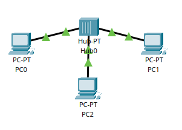
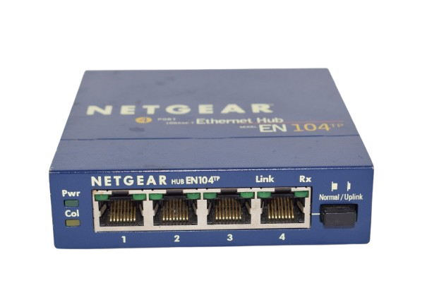
  
  </h4>

  <h4>
  But one problem with the Hub is that, whenever a ping request or message arrives to it, the message will duplicate itself to     other devices in that network, meaning, the Hub's only job is to duplicate traffic to all devices. To solve this, they made       Switches. Switches job is to hand the message over to the right destination without any trouble. This is how a small network      with a switch looks like
  </h4>

  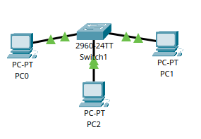
  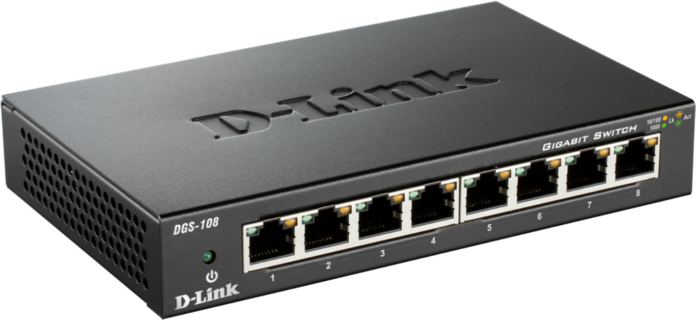

  <h1 align="center">Network layers (1-2)</h1>

  <h5>Layer 1: Hardware/Physical things, like cables </h5>
  <h5>Layer 2: Mac Address etc</h5>

  <ul>
   <ls>
  <li>Hardware: This is the physical things like the metal and components inside of your computer</li>
  <li>Mac address: A code burnt in on your device. Every device has a mac address. This is like an ip address, or home address. This code almost should never change, because it is like an identifier for the device</li>
  </ls>
  </ul>
  
  </h4>
After that the computers has been connected with a Switch, a problem remains. For instance, pc0 doesn't know the mac address of pc1, which is neccessary for the communication, since Switches only understands layer 2, or in other words, switches can only transfer a message with mac addresses attached to the message. This is where ARP (address resolution protocol) messages comes into play. The ARP message is a message that a device sends to all devices in the network in order to find out what their mac address is. Lets make a scenario. "Pc0 wants to communicate with pc1": 
  </h4>

  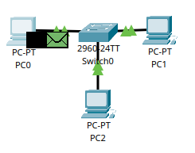

  <h3>Pc0 pings pc1 with this command "ping 192.168.1.2"</h3>
  <h4>🟩 Green message: The ARP message, this message contains the ip address of the destination/receiver, and finds out the mac           address of it</h4>
  <h4>⬛ Black message: Actual ping request, this message contains the ip address of the sender and destination. But not the destination's mac address, that's the ARP's job
  </h4>

  <h4>This is what the ARP message currently contains:</h4>

  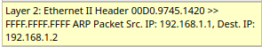

  </ul>
  
<ul>
   <ls>
  <li>Ethernet: The cable used to connect the computer and the switch</li>
  <li>00D0.9745.1420: This the source mac address, aka the sender's mac address which is pc0</li>
  <li>FFFF.FFFF.FFFF: This is the blank mac address holder for the destination's mac address, which is pc1's mac address</li>
  <li>Src. ip: The ip address of the sender/pc0</li>
  <li>Dest ip: Ip address of the destination, aka pc1's ip address</li>
  </ls>
  </ul>

  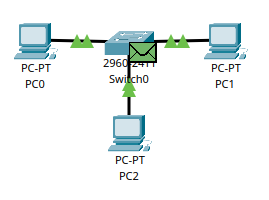

  <h4>
    Both ARP (🟩 ) and the ping request (⬛) has reached the Switch. The Switch knows that this is an ARP message, and therefore duplicates it to the other devices:
  
  </h4>

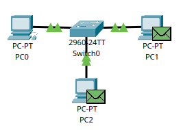

  <h4>
    Since the ip address doesn't match for pc2, it will be destroyed. In the other hand, it matches the pc1's ip address, which       means the ARP request has been succesfully delivered. Now the ARP message has to be sent back to pc0 so that pc0 acknowledges that it has been delivered and read. Now the last step is for pc1 do contact pc0 back.
  </h4>

  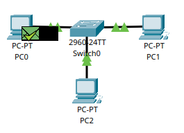

  <h4>
    Now pc0 and the switch have learned where pc1 lives through its mac address. From now on, the ARP message is useless because pc0 and pc1 are friends, both of them know where they each live, which means they are now free to communicate with each other without any issues through mac addresses. All of this is happening within seconds, but we just slowed down the progress so it becomes easier. This is how it actaully looks like behind the scenes:

  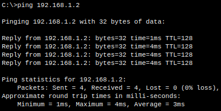
    
  </h4>

  <h1 align="center">OSI model & TCP/IP model (layer 3-7)</h1>

  <h4 align="center">There are two main network structures. They are called the OSI model and TCP/IP model. The OSI model has 7 layers while TCP/IP combines the 5th, 6th, and 7th layer into one layer, which is equal to only 5 layers.</h4>

  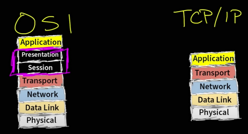

  <h2>---> Layer3 <---</h2>

  <h4>This section is mostly about ip addresses, routers, and packets.</h4>

  <li><strong>Ip address:</strong>

  Think of it as a home address but for devices. You use ip addresses to send messages, receive messages, yet you can move to a different house, which is equivalent to a device switching networks and getting a new ip address, for example, when    connecting to a restaurant free network.
  </li>
  
  <ul>

  <li><strong>Router:</strong>

  Routers can forward a message using ip addresses. When a message reaches your local router from the inside (LAN: local area network) or outside (WAN: wide area network), it will do its things according to the configuration.

  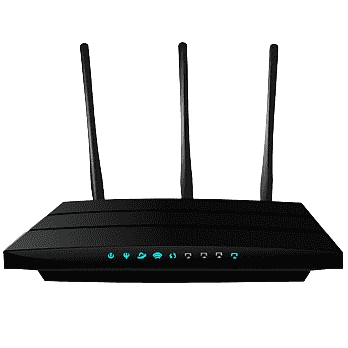
    
  </li>

  <li><strong>Packets:</strong>

  <strong>The messages that you are sending when working with layer 3 is called "packets", while for example in layer 2 they are called "frames". </strong> 
  </li>
  
</ul>

<h2>----> Layer4 <----</h2>

  <h4 >This section is mostly about transport protocols</h4>

  <ul>
   <ls>
      <li><strong>Transport protocols:</strong>

  <strong>When your router sends a message through the internet, to for example enter a website, it typically uses the TCP (transmission control protocol) or UDP (User Datagram Protocol). For now just know that TCP is more reliable, while UDP is faster.</strong> 
  </li>
   </ls>
  </ul>

  <h2>-----> Layer 5 <-----</h2>

  <h4>The session layer is all about keeping the connection between you and the website you are trying to interact with. It can use extra protocols such as l2tp (layer 2 tone protocol) or rtcp (remote transport control protocol) which is used for setting up phone calls. This conenction is called the "3 way handshake"</h4>

<ul>
   <ls>
      <li><strong>3 way handshake:</strong>

  <strong>
  
  In order for you to visit a website, like youtube.com, you need to first communicate. So you open your browser and type the website. Secondly, behind the scenes, you send a message called "syn" (synchronize), which is a message that sees if the a website is up. When the message reaches for example youtube, then it will respond with a "syn ack" (synchronize-acknowledge) message saying "hello client, im online". Lastly when youtube sends the message back to you, you will respond with an "ack" (acknowledge) message saying "okay we are good to go". Now you are in the website. For more on this, check out this youtube video: 
  
  <a href="https://youtube.com/shorts/N-j-FZ5c9n0?si=h40a15OyBupW0PjN" target="_blank">
  3-Way Handshake Explained
</a>
  </strong> 
  </li>
   </ls>
  </ul>

  <h2>------> Layer 6 <------</h2>

  
  <h4>This layer is called "presentation". This is a layer that gives you the gui (graphical user interface) and the things you see when entering a website. It is responisble for the data format and file types </h4>

<ul>
   <ls>
      <li><strong>Data format & file type:</strong>

  <strong>When you enter a website, you are mostly greeted with an .html file. This is a file that renders the website. From the background color, to all the text, font and so on. Most common data format/file types are .html, .js and .css.</strong> 
  </li>
  <li>.js: Java script. Used when you want to script a button or animations</li>
  <li>.css: Its a programming language called "CSS". It is used to fade, shade, and make everthing seem much cleaner and better. </li>
   </ls>
  </ul>

  <h2>-------> Layer 7 <-------</h2>

  <h4>This is the last layer, and its called the "application" layer. This layer is mostly about the browser, protocols such as http and https</h4>

<ul>
   <ls>
  <li>Browser: When you open your browser and type the website, in a way, you interact with the 7th layer. More of this under</li>
  <li>Ports: A port is like a tunnel that allows connections. When you start your computer, by deafult you will create different ports so that your computer works properly. Ports allow connections, for example, when you visit youtube, there has to be a way for the flow of information to pass by, which is ports. They allow connections, and informations to pass in, and out of it. Ports also have the so called "port number" which is like an ip address but for ports. Its a location for the port. For instance, if you want to connect to a port, you would specify the port number. 
  </li>

  <li>Http (Hypertext Transfer Protocol): This is a protocol that lets you connect to websites. To create a http connection, you will need a port. The port number for http is 80. Note that you can change the port number but thats the deafult</li>
  <li>Https (Hypertext Transfer Protocol secure): Updates version of http and does the same job but more secure. It encrypts the traffic and overall more secure. The port number for https is 443. Note that you can change the port number but thats the deafult</li>
  
  </ls>
  </ul>

  

  
</strong>

