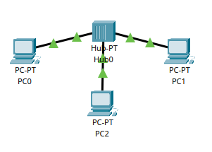
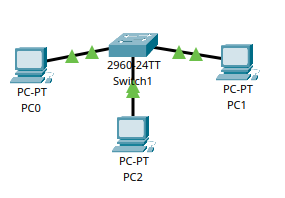

  <h1 align="center">
    Welcome to the Networking Module!
  </h1>
  <h3 align="center">
    Why learn networking?
  <h3>
  <strong>
   <ul align="center">
      <li>1️⃣ In Cyber Security, there are many roles that involves networking</li>
      <li>2️⃣ Generally in hacking, you need to learn how to move, configure and troubleshoot networking issues/errors</li>
      <li>3️⃣ This skill will make you be able to identify vulnerabilities in companies or in your own local network. This also makes you safe when defending yourself or your company</li>
    </ul>
  </strong>

<strong>
  <h3 align="center">
    What you will learn in this module
  </h3>

  <strong>
  <ul>
    <li>1. What is a network?</li>
    <li>2. Hubs and Switches</li>
    <li>3. Network layers (1-2) & ARP</li>
    <li>4. Network layers (3-7) & OSI /TCP/IP model</li>
    <li>5. What happens when you visit Youtube, explained with the TCP/IP model</li>
  </ul>
  </strong>

  <h1 align="center">Network</h1>
  <h4>A network can come with various styles. As for instance, your local network surely have a router, and devices connected to it (like phones and tvs), thats your network, your local network. Not diving more into it, lets learn about networking
  </h4>

  <h1 align="center">Hubs and Switches</h1>

  <h4>In order for computers to talk to each other, they need a cable attached to their ends. But how would multiple computers talk to each other? Well now we talking Hubs. They allow multiple computers to talk and communicate, like this:

  
  </h4>

  <h4>
  But one problem with the Hub is that, whenever a ping request or message arrives to it, the message will duplicate itself to     other devices in that network, meaning, the Hub's only job is to duplicate traffic to all devices. To solve this, they made       Switches. Switches job is to hand the message over to the right destination without any trouble. This is how a small network      with a switch looks like
  </h4>

  
  

  
</strong>

