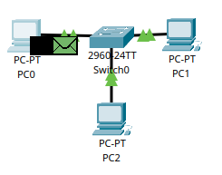
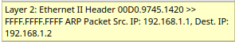
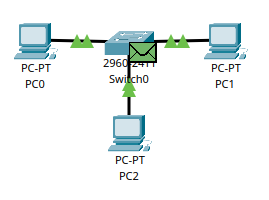
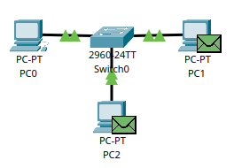
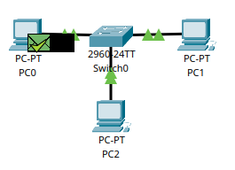
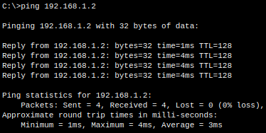
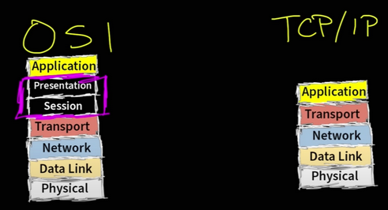

  <h1 align="center">
    Welcome to the Networking Module!
  </h1>
  <h3 align="center">
    Why learn networking?
  <h3>
  <strong>
   <ul align="center">
      <li>1️⃣ In Cyber Security, there are many roles that involves networking</li>
      <li>2️⃣ Generally in hacking, you need to learn how to move, configure and troubleshoot networking issues</li>
      <li>3️⃣ This skill will make you be able to identify vulnerabilities in companies or in your own local network. This also makes you safe when defending yourself or your company</li>
    </ul>
  </strong>

<strong>
  <h3 align="center">
    What you will learn in this module
  </h3>

  <strong>
  <ul>
    <li>1. What is a network?</li>
    <li>2. Hubs and Switches</li>
    <li>3. Network layers (1-2) & ARP</li>
    <li>4. Network layers (3-7) & OSI /TCP/IP model</li>
    <li>5. What happens when you visit Youtube, explained with the TCP/IP model</li>
  </ul>
  </strong>

  <h1 align="center">Network</h1>
  <h4>A network can come with various styles. As for instance, your local network surely have a router, and devices connected to it (like phones and tvs), thats your network, your local network. Not diving more into it, lets learn about networking
  </h4>

  <h1 align="center">Hubs and Switches</h1>

  <h4>In order for computers to talk to each other, they need a cable attached to their ends. But how would multiple computers talk to each other? Well now we talking Hubs. They allow multiple computers to talk and communicate, like this:

  
  </h4>

  <h4>
  But one problem with the Hub is that, whenever a ping request or message arrives to it, the message will duplicate itself to     other devices in that network, meaning, the Hub's only job is to duplicate traffic to all devices. To solve this, they made       Switches. Switches job is to hand the message over to the right destination without any trouble. This is how a small network      with a switch looks like
  </h4>

  

  <h1 align="center">Network layers (1-2)</h1>

  <h5>Layer 1: Hardware/Physical things, like cables </h5>
  <h5>Layer 2: Mac Address etc</h5>
  </h4>
After that the computers has been connected with a Switch, a problem remains. For instance, pc0 doesn't know the mac address of pc1, which is neccessary for the communication, since Switches only understands layer 2, or in other words, switches can only transfer a message with mac addresses attached to the message.This is where ARP (address resolution protocol) messages comes into play. The ARP message is a message that a device sends to all devices in the network in order to find out what their mac address is. Lets make a scenario. "Pc0 wants to communicate with pc1": 
  </h4>

  

  <h3>Pc0 pings pc1 with this command "ping 192.168.1.2"</h3>
  <h4>🟩 Green message: The ARP message, this message contains the ip address of the destination/receiver, and finds out the mac           address of it</h4>
  <h4>⬛ Black message: Actual ping request, this message contains the ip address of the sender and destination. But not the destination's mac address, that's the ARP's job
  </h4>

  <h4>This is what the ARP message currently contains:</h4>

  

  <h5>Ethernet: The cable used to connect the computer and the switch</h5>
  <h5>00D0.9745.1420: This the source mac address, aka the sender's mac address which is pc0</h5>
  <h5>FFFF.FFFF.FFFF: This is the blank mac address holder for the destination's mac address, which is pc1's mac address</h5>
  <h5>Src. ip: The ip address of the sender/pc0</h5>
  <h5>Dest ip: Ip address of the destination, aka pc1's ip address</h5>

  

  <h4>
    Both ARP (🟩 ) and the ping request (⬛) has reached the Switch. The Switch knows that this is an ARP message, and therefore duplicates it to the other devices:
  
  </h4>

  <h4>
    Since the ip address doesn't match for pc2, it will be destroyed. In the other hand, it matches the pc1's ip address, which       means the ARP request has been succesfully delivered. Now the last step is for pc1 do contact the original sender, pc0
  </h4>

  

  <h4>
    Now pc0 and the switch have learned where pc1 lives through its mac address. From now on, the ARP message is useless because pc0 and pc1 are friends, both of them know where they each live, which means they are now free to communicate with each other without any issues. All of this is happening within seconds, but we just slowed down the progress so it becomes easier. This is how it actaully looks like behind the scenes:

  
    
  </h4>

  <h1 align="center">OSI model & TCP/IP model (layer 3-7)</h1>

  <h4 align="center">There are two main network structures. They are called the OSI model and TCP/IP model. The OSI model has 7 layers while TCP/IP combines the 5th, 6th, and 7th layer into one layer, which is equal to only 5 layers.</h4>

  

  <h3>---> Layer3 <---</h3>

  <h4>This section is mostly about ip addresses, routers, transport protocols and packets.</h4>

  <ul>
  <li><strong>Ip address:</strong> Think of it as a home address but for devices. You use ip addresses to send messages, receive messages, yet you can move to a different house, which is equivalent to a device switching networks and getting a new ip address, for example, when connecting to a restaurant free network.
  </li>

  <li><strong>Router:</strong>

  Routers can forward a message using ip addresses. When a message reaches your local router from the inside or outside, it will do its things according to the configuration.

  
    
  </li>
    
</ul>

  

  
</strong>

